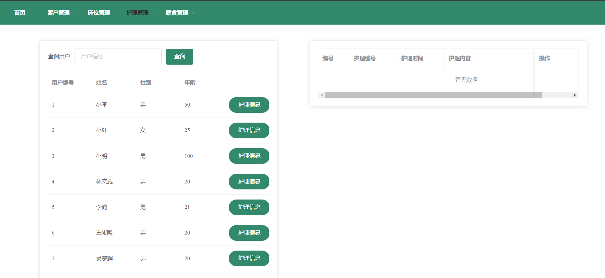

# 颐养中心（Nursing Center）

软件综合课程设计 大作业

本项目基于 Vue + SSM 框架开发，使用 Element UI 组件库。

林文威 [evanlynn.wei@gmail.com](mailto:evanlynn.wei@gmail.com) 李鹤 [baigenino@163.com](mailto:baigenino@163.com) 王彬瞻 吴宗辉

## 项目预览





## 运行项目

### 初始化数据库

创建名为nursing的数据库，并运行根目录下的nursing.sql

### 前端初始化运行

```
cd frontend
npm install
npm run serve
```

### 后端初始化

后端为Maven项目，使用IDEA打开，并运行build project.
修改Spring配置文件`application.properties`中的`web.upload-path`属性，将其修改为本地的绝对路径。

## 项目结构

## 项目分工

林文威：
- 用例设计
- 页面布局设计
- 膳食管理模块
- 膳食日历组件

李鹤：
- 数据库设计
- 登录模块
- 客户管理模块

王彬瞻：
- 护理管理模块

吴宗辉：
- 床位管理模块